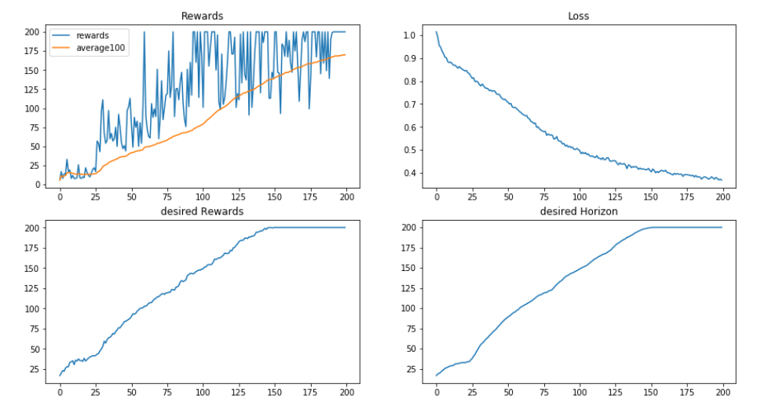
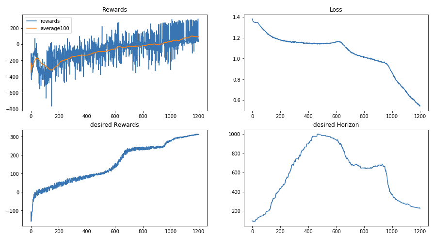

# Upside-Down-Reinforcement-Learning

Upside-Down Reinforcement Learning (⅂ꓤ) implementation in Pytorch.  
Based on the paper published by *Jürgen Schmidhuber*: [⅂ꓤ-Paper](https://github.com/BY571/Upside-Down-Reinforcement-Learning/tree/master/paper)

This repository contains a **discrete action space** as well as a **continuous action space**  implementation for the OpenAI gym CartPole environment ([continuous](https://gist.github.com/iandanforth/e3ffb67cf3623153e968f2afdfb01dc8) version of the environment).

The notebooks include the training of a behavior function as well as an evaluation part, where you can test the trained behavior function. Feed it with an **desired reward** that the agent shall achieve in a **desired time horizon**.

## Plots for the discrete CartPole Environment:

## Plots for the continuous CartPole Environment:

### Plots for the LunarLander Environment:

TODO:
- test some possible improvements mentioned in the paper (6. Future Research Directions).

