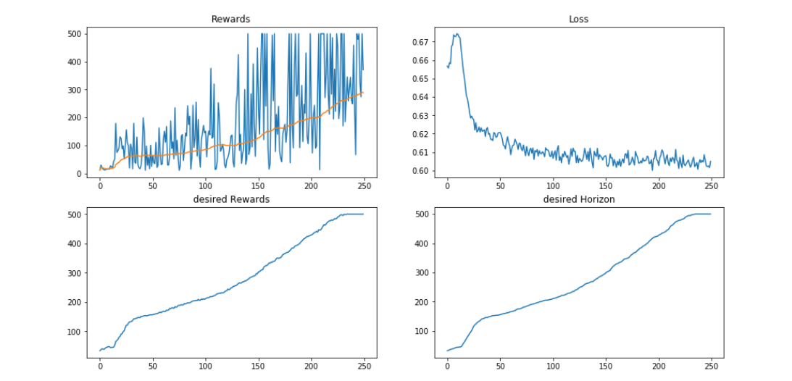

# Upside-Down-Reinforcement-Learning

Upside-Down Reinforcement Learning (⅂ꓤ) implementation in Pytorch.  
Based on the paper published by *Jürgen Schmidhuber*: [⅂ꓤ-Paper](https://github.com/BY571/Upside-Down-Reinforcement-Learning/tree/master/paper)

Currently this repository contains only a discrete action space implementation for the OpenAI gym CartPole environment.

The notebook includes the training of a behavior function as well as an evaluation part, where you can test the trained behavior function. Feed it with an **desired reward** that the agent shall achieve in a **desired time horizon**.

## Plots for the CartPole Environment:

ToDo: Continuous action space implementation.
